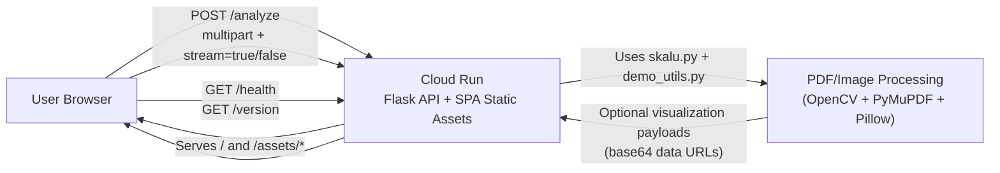
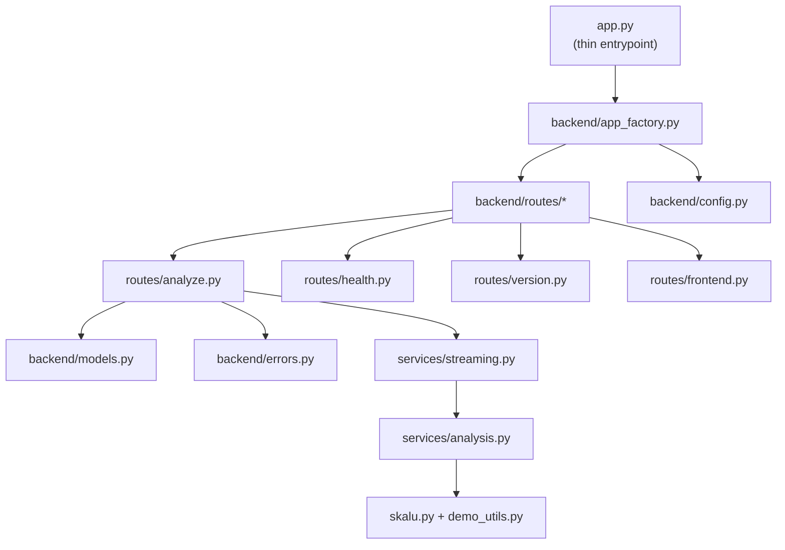
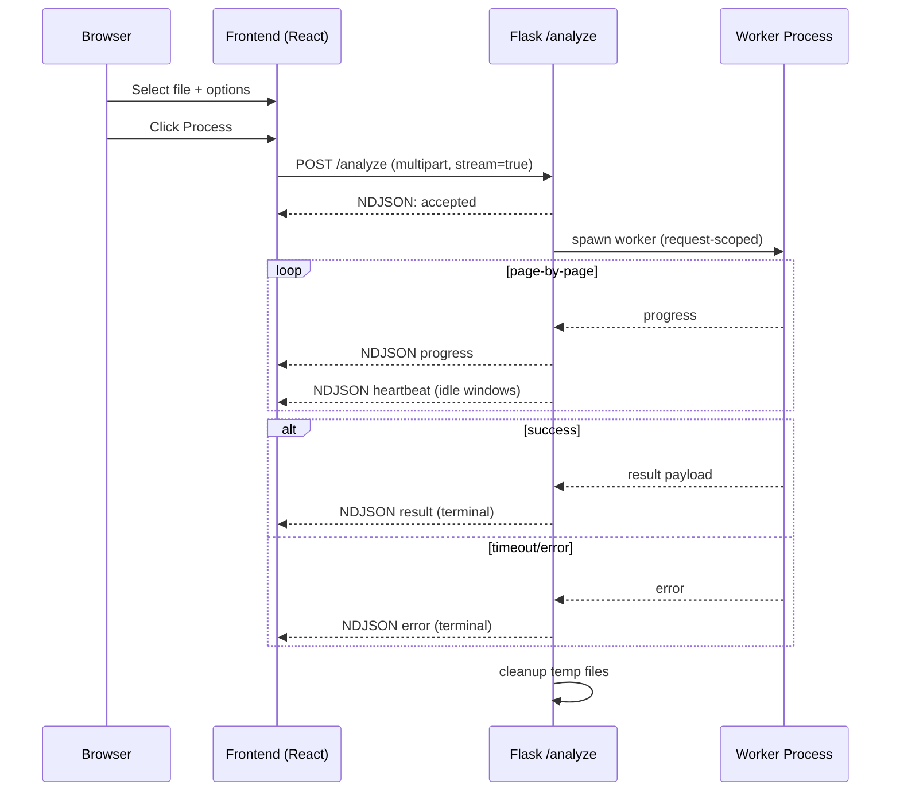
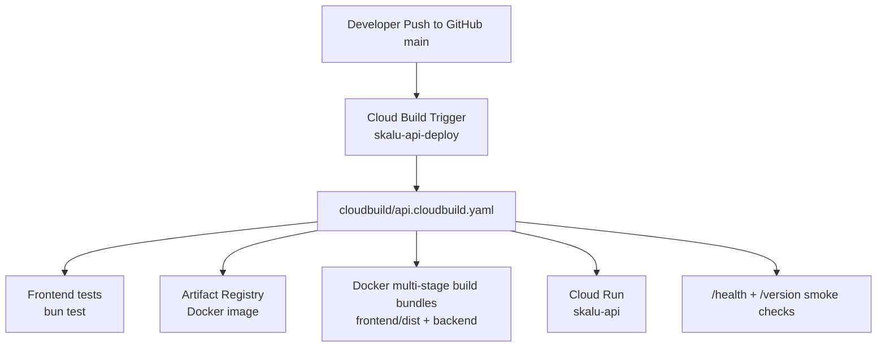
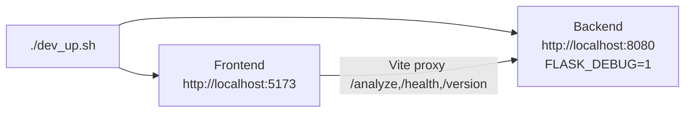

# Skalu Architecture

This document explains the current end-to-end architecture for local development, runtime behavior, infrastructure, and deployments.

## 1) System Overview

Skalu is a two-tier system:

- Backend API: Flask on Cloud Run (`POST /analyze`, `GET /health`, `GET /version`)
- Frontend SPA: Vite + React + TypeScript, built into the same Cloud Run container and served by Flask

The backend is single-shot and stateless:
- one request does upload + processing + response
- no persisted job/session store
- optional in-request NDJSON streaming for progress

## 2) High-Level Architecture

## 3) Backend Module Layout

Key behavior:
- `routes/analyze.py`: validates input, saves upload to request-scoped temp dir, returns JSON or NDJSON stream.
- `services/streaming.py`: runs processing in a worker process, emits `accepted/progress/heartbeat/result/error`, enforces timeout.
- `services/analysis.py`: invokes PDF/image processing and composes final payload.
- `routes/frontend.py`: serves built SPA files from `frontend/dist` in Cloud Run.
- `config.py`: env-driven runtime config and backend version loading from `pyproject.toml`.

## 4) API Contract

### `GET /health`
- Returns `{ "status": "ok" }`.

### `GET /version`
- Returns backend metadata and optional frontend version header echo.
- Shape:
  - `backend_version`
  - `frontend_version`
  - `git_sha`
  - `build_time`

### `POST /analyze` (multipart/form-data)
- Fields:
  - `file`
  - `include_empty_pages` (`true|false`)
  - `include_visualizations` (`true|false`)
  - `stream` (`true|false`)
  - detection params:
    - `min_line_width_ratio`
    - `max_line_height`
    - `min_rect_area_ratio`
    - `max_rect_area_ratio`

Modes:
- `stream=false` -> one JSON response
- `stream=true` -> `application/x-ndjson` line-delimited events

NDJSON event types:
- `accepted`
- `progress`
- `heartbeat`
- `result` (terminal success)
- `error` (terminal failure)

## 5) Single-Request Processing Flow

## 6) Frontend Architecture

Main pieces:
- `frontend/src/App.tsx`: upload + options + explicit process trigger + progress state + version display.
- `frontend/src/lib/api.ts`:
  - `analyzeFileStream()` NDJSON parser with chunk boundary handling.
  - `fetchVersion()`.
- `frontend/src/components/ResultsPanel.tsx`:
  - virtualized page rendering (`@tanstack/react-virtual`) for large PDFs.
  - page-aware visualization mapping.

Build-time version constants:
- `__APP_VERSION__`, `__APP_GIT_SHA__` injected by Vite config.

## 7) Deployment Architecture

CD is a single Cloud Build trigger from GitHub pushes to `main`.

## 8) IaC Ownership (Terraform)

Terraform (`infra/`) manages:
- required project APIs
- Artifact Registry repository
- Cloud Run service + runtime env defaults
- Cloud Build deployer service account + IAM bindings
- Cloud Build GitHub trigger for deploy pipeline

Not fully IaC due OAuth handshake:
- one-time Cloud Build GitHub App authorization/connection in console.

## 9) Release and Versioning

Release Please manifest mode manages versions by conventional commits:
- backend component: `pyproject.toml` version
- frontend component: `frontend/package.json` version

Commit semantics:
- `fix:` -> patch
- `feat:` -> minor
- `feat!:` or `BREAKING CHANGE:` -> major

## 10) Local Development

`dev_up.sh` handles:
- startup of both services
- signal trapping and shutdown logs
- process-tree and port cleanup

## 11) Reliability and Limits

- No durable jobs/sessions; request-scoped execution only.
- Timeout enforced by backend (`ANALYZE_TIMEOUT_SECONDS`, max 3600).
- Stream heartbeat controlled by `STREAM_HEARTBEAT_SECONDS`.
- Cloud Run configured with concurrency `1` for predictable CPU-bound processing behavior.

## 12) Security and Access

- API is public (`roles/run.invoker` for `allUsers`) by design for the current product shape.
- CORS is configured via `ALLOWED_ORIGINS`.
- Deployment auth to GCP is handled by Cloud Build service account IAM (not GitHub secrets for deploy).

## 13) Setup Checklist (End-to-End)

1. Run bootstrap:
   - `scripts/bootstrap_cloud.sh --project-id ... --github-owner ... --github-repo ... --allowed-origins ... --run-terraform-apply`
2. In Cloud Console, connect GitHub repo to Cloud Build App (one-time).
3. Push to `main`.
4. Verify:
   - `GET /health`
   - `GET /version`
