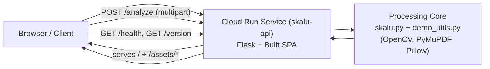
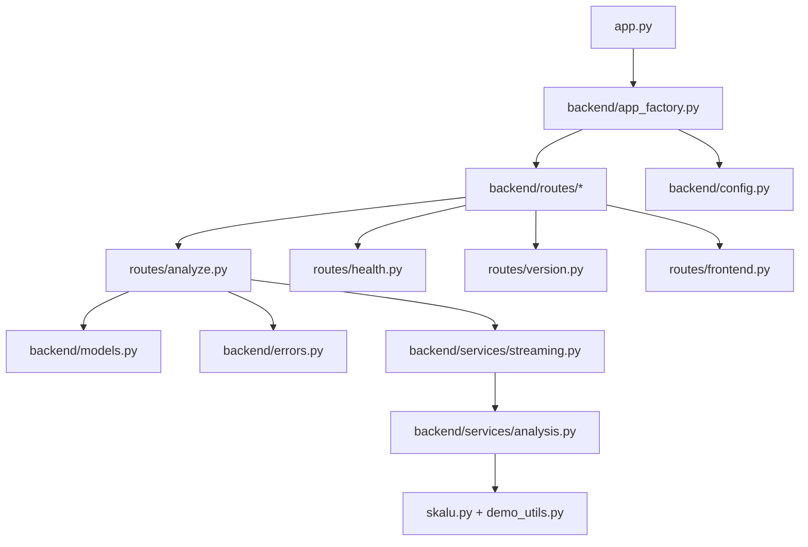
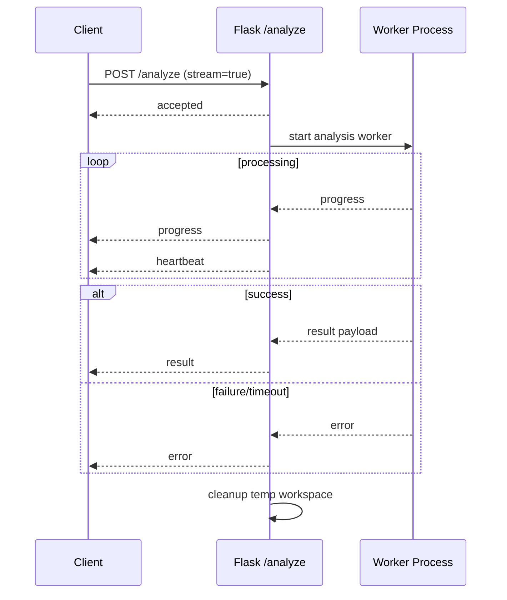

# Skalu Architecture

This document describes the current runtime architecture, module structure, API contracts, delivery pipelines, and version/declaration strategy.

## 1) System Overview

Skalu is a single Cloud Run service that serves both:

- Backend API (Flask): upload/download/analysis/version endpoints.
- Frontend SPA (Vite + React): built assets served by Flask.

Processing model:

- Request-scoped, stateless execution.
- No durable queue or job store.
- Optional in-request NDJSON streaming for progress.

## 2) Runtime Topology

## 3) Backend Architecture

Primary responsibilities:

- `routes/analyze.py`:
  - parses multipart input, including `file_url` mode.
  - validates URL/network constraints and file limits.
  - creates request temp workspace and guarantees cleanup.
  - supports `stream=false` JSON and `stream=true` NDJSON.
- `services/streaming.py`:
  - runs analysis worker with timeout.
  - emits `accepted`, `progress`, `heartbeat`, `result`, `error`.
- `services/analysis.py`:
  - invokes processing for PDF/image.
  - assembles API payload (`detection_params`, `result_data`, `visualizations`, `debug_groups`).
- `routes/frontend.py`:
  - serves compiled SPA output from `frontend/dist`.
- `config.py`:
  - runtime env defaults and backend version metadata loading.

## 4) Frontend Architecture

Key modules:

- `frontend/src/App.tsx`:
  - upload URL/file flow, option controls, progress lifecycle.
- `frontend/src/lib/api.ts`:
  - multipart form building and NDJSON client parser.
- `frontend/src/components/ResultsPanel.tsx`:
  - virtualized page rendering for large results.
- `frontend/src/types.ts`:
  - canonical TypeScript API contracts.
- `frontend/src/schemas/analyzePayload.ts`:
  - Valibot runtime schema for payload contract validation.

Frontend testing boundaries:

- Bun tests: `frontend/tests/**` (unit + integration).
- Playwright tests: `frontend/e2e/**`.

## 5) API Contract

### `GET /health`

- Response:
  - `{ "status": "ok" }`

### `GET /version`

- Response fields:
  - `backend_version`
  - `frontend_version`
  - `git_sha`
  - `build_time`

### `POST /analyze` (multipart/form-data)

Input fields:

- Source:
  - `file` OR `file_url` (mutually exclusive).
- Flags:
  - `include_empty_pages`
  - `include_visualizations`
  - `stream`
- Detection params:
  - `min_line_width_ratio`
  - `max_line_height`
  - `min_rect_area_ratio`
  - `max_rect_area_ratio`

Success payload (`stream=false`) shape:

- `detection_params` (top-level)
- `result_data` (typed union)
  - PDF shape:
    - `pages[]`
    - `dpi`
  - Image shape:
    - `result` map by filename
- `processed_filename`
- `visualizations[]`
- `debug_groups[]`

Streaming mode (`stream=true`):

- Content type: `application/x-ndjson`
- Event types:
  - `accepted`
  - `progress`
  - `heartbeat`
  - `result` (terminal success)
  - `error` (terminal failure)

## 6) Request Processing Flow

## 7) Infrastructure and Deployment

Terraform (`infra/`) manages:

- Project services/APIs.
- Artifact Registry repo.
- Cloud Run service config.
- Cloud Build deployer service account + IAM.
- GitHub Cloud Build trigger.

Cloud Build pipeline (`cloudbuild/api.cloudbuild.yaml`):

1. Run frontend tests.
2. Build/push Docker image.
3. Deploy Cloud Run revision.
4. Smoke-check `/health` and `/version`.

Runtime model:

- Cloud Run concurrency = 1 (predictable CPU-bound behavior).
- Min instances = 0.
- Frontend + backend in one image/container.

## 8) CI / Release Workflows

- `.github/workflows/test.yml`:
  - backend pytest
  - frontend bun tests
  - coverage upload
- `.github/workflows/release.yml`:
  - Release Please (manifest mode, backend + frontend components).
- `.github/workflows/release-types.yml`:
  - on published release, generate and upload `skalu-api.d.ts` asset.

## 9) Type Contract and Declaration Strategy

Strong typing inside repo:

- Source-of-truth TS contracts: `frontend/src/types.ts`.
- Runtime schema contract checks: `frontend/src/schemas/analyzePayload.ts` (Valibot).
- Drift guard tests:
  - `frontend/tests/unit/analyzePayload.contract.test.ts`
  - validates runtime shape and compile-time type parity.

Declaration generation for external clients:

- Command:
  - `cd frontend && bun run types:generate`
- Output:
  - `frontend/dist-types/skalu-api.d.ts`
- Release asset publishing:
  - automated by `release-types.yml`.

## 10) Versioning Semantics

Release Please (conventional commits):

- `fix:` patch
- `feat:` minor
- `feat!:` or `BREAKING CHANGE:` major

Version sources:

- Backend: `pyproject.toml`
- Frontend: `frontend/package.json`

Displayed in app footer:

- Frontend version from build-time constants.
- Backend version/git/build from `/version`.

## 11) Local Development

Quick start:

- `./dev_up.sh` starts backend + frontend.

Backend only:

- `source .venv/bin/activate && python app.py`

Frontend only:

- `cd frontend && bun run dev`

## 12) Operational Constraints and Security

- Stateless request execution; no persisted job/session state.
- Timeout bounded by backend settings (`ANALYZE_TIMEOUT_SECONDS`).
- Streaming heartbeat interval controlled by `STREAM_HEARTBEAT_SECONDS`.
- CORS controlled with `ALLOWED_ORIGINS`.
- Public invoker model for current deployment profile.
