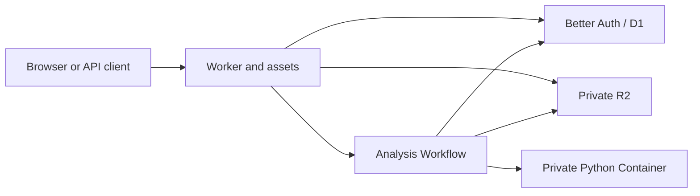

# Architecture

Skalu is a Bun workspace with a native Python engine. Workers serves React/Vite assets, Better Auth and job APIs. D1 stores users, sessions, hashed keys, admission state and committed page receipts. R2 holds originals and page artifacts. Workflows coordinates private Cloudflare Containers.

```mermaid
flowchart LR
  client[Browser or API client] --> worker[Worker and assets]
  worker --> d1[Better Auth / D1]
  worker --> r2[Private R2]
  worker --> workflow[Analysis Workflow]
  workflow --> engine[Private Python Container]
  workflow --> r2
  workflow --> d1
```

## Boundaries

- `apps/web/src/`: account/key UI, chunked PDF upload and incremental workbench.
- `apps/worker/src/auth.ts`: request-scoped auth and immutable owner IDs.
- `jobs.ts`: admission, upload/start state, artifacts and streamed downloads.
- `workflow.ts`: inspection, page retries, publication, terminal states and cache release.
- `engine.ts`: private Container binding; loopback-only development transport.
- `cleanup.ts`: expiration, Workflow reconciliation and storage deletion.
- `packages/engine/skalu.py`: canonical renderer/detectors/CLI. Page selection uses the original document directly, preserving MediaBox/CropBox semantics.
- `packages/engine/server.py`: stream-to-disk ingestion and killable native processing. No public route, R2 credentials, auth database or outbound internet.

## Lifecycle

`uploading → queued → running → completed/failed → expired`

A conditional SQLite insert claims global/per-user capacity atomically. Every request checks ownership and expiry. Part streams have enforced actual byte counts, PDF magic and fixed lengths. R2 multipart ETags/sizes persist in D1; completing a previously completed upload recovers from its durable source object.

R2 persistence precedes queued state and Workflow creation. Workflow ID equals job UUID. Creation retries prove existing instances, and cron repairs missing queued instances. R2/D1/Workflow are separate services; recoverable state handles their non-transactional boundaries.

Inspection checks validity, encryption, page count and render dimensions before pixel allocation. Each original page uses the CLI renderer, writes deterministic JSON/JPEG R2 keys, then commits a unique D1 receipt. Progress derives from committed receipts; retries cannot double-count. A container cache miss reloads the original from R2. Large artifacts never become Workflow return values.

Blank pages advance progress. Browser polling displays committed images while processing continues. Reloading `?job=UUID` reconnects. Completed exports stream one page object at a time with backpressure; incomplete downloads return 409.

Deletion marks expired first to revoke access, terminates the Workflow, awaits force-destruction of the private container (or kills and joins the local native child), then removes cache and artifacts/receipts. Persisted Workflow expectation and capacity ownership survive retries; capacity is released only after shutdown and cleanup succeed. The pinned SDK `stop()` only signals; `destroy()` awaits runtime teardown, and a rejected teardown leaves capacity reserved for retry. See the [runtime destroy contract](https://developers.cloudflare.com/containers/api/durable-object-container/#destroy). Tombstones support late-write sweeps. Cron repairs queued jobs, marks interrupted terminal Workflows failed and expires stale jobs. R2 lifecycle is a storage backstop.

## Budgets

8 MiB upload parts; 256 MiB originals; 1,000 pages; 16 million rendered pixels/page; one billion pixels/document; 1 MiB page JSON; 8 MiB JPEG. Native children have 60-second CPU and 65-second wall limits, plus a 3 GiB address-space limit on Linux. Standard-1 containers provide 4 GiB memory. One Gunicorn process uses four HTTP threads so cancellation remains responsive; a native-processing lock permits one memory-bounded child at a time. Three active jobs plus a deployment check fit four instances. Jobs have a two-hour deadline.

These ceilings reject unsupported work explicitly; they do not guarantee arbitrary PDF complexity can complete. Verify current [Worker](https://developers.cloudflare.com/workers/platform/limits/), [Workflow](https://developers.cloudflare.com/workflows/reference/limits/) and [Container](https://developers.cloudflare.com/containers/platform/limits/) limits before increasing budgets.

## Delivery

`bun run deploy` checks/builds, provisions D1/R2, bootstraps missing auth secrets, applies migrations before activation and verifies live engine rollout. Auth failures never trigger replacement; existing remote auth secrets remain intact. Generated config/secrets are ignored and temporary secret files are removed.

Production is the `skalu` Worker at `https://skalu.ilmtest.net`, configured as a custom domain in `apps/worker/cloudflare.config.ts` and deployed with `cf`. Authentication, CSRF origin checks and rollout verification use that same origin. The workers.dev and preview endpoints are disabled. Root `wrangler.jsonc` is the separate Docker-free local emulator/type-generation configuration.

Worker activation precedes container rollout. Protocol 1 stays compatible while versions mix; success waits for the precise engine version. Pages must match the engine version recorded during inspection; a changed engine fails the job explicitly before publishing mixed-version results. Retain rollback images and use additive migrations. App and engine release independently; exports record the version actually used.

Local configuration uses localhost and the loopback native service. Local Miniflare plus real Python validates application behavior. Docker/Linux native-wheel and deployed binding/rollout proof remain distinct. Container response streams must pass through `FixedLengthStream` before R2 publication; RPC transport does not preserve the runtime's known-length marker. The declared length is bounded and the stream enforces actual bytes.
